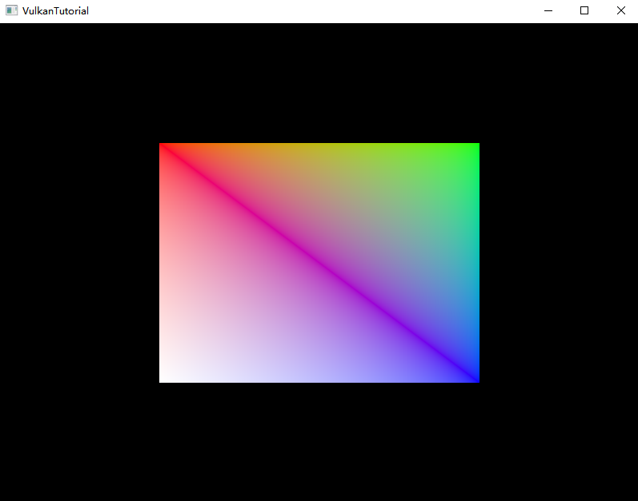

# LetsVulkan
Time to learning Vulkan instead of OpenGL.

### Software Requirements
- **Visual Studio 2022** (I used C++20)
  
## Getting Started

1. Downloading the repository:
   
   Start by cloning the repository:
   ```bash
   git clone --recursive git@github.com:ssgaryss/LetsVulkan.git
   ```
   
   If the repository was cloned non-recursively previously, use the following command to clone the necessary submodules:
   ```bash
   git submodule update --init
   ```

3. Configuring the dependencies:
   
   Run the Setup.bat file found in scripts folder. This will downdload all you need and build the project with VS2022.
## Vulkan Tutorial
Device local Vertex and Index Buffers.


The first triangle with about 1000 lines of code.


